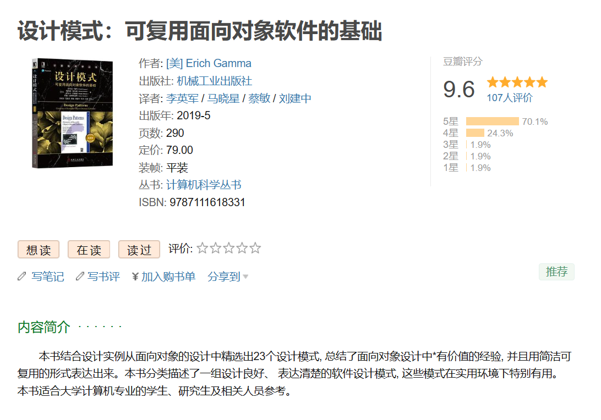

<div align="center">

<h1>learn-GoF</h1>

</div>

<h2>目录</h2>

- [什么是设计模式？](#什么是设计模式)
  - [概念](#概念)
  - [背景](#背景)
  - [分类](#分类)
    - [创建型模式、结构型模式和行为型模式](#创建型模式结构型模式和行为型模式)
    - [类模式和对象模式](#类模式和对象模式)
  - [应用优势](#应用优势)
- [创建型模式（Creational Pattern）](#创建型模式creational-pattern)
  - [工厂方法（Factory Method）](#工厂方法factory-method)
  - [抽象工厂（Abstract Factory）](#抽象工厂abstract-factory)
  - [单例模式（Singleton）](#单例模式singleton)
  - [建造者模式（Builder）](#建造者模式builder)


# 什么是设计模式？

## 概念

**设计模式（Design Pattern）是一套被反复使用、多数人知晓、经过分类编目的代码设计经验的总结**。使用设计模式是为了可重用代码、让代码更容易被他人理解、保证代码可靠性。换句话说，设计模式是一种通用的解决问题的方法，它提供了在特定情境下解决一般问题的模板。

> “A pattern is a **solution** to a problem in a **context**”

## 背景

随着开发经验的积累，我们会逐渐形成一些**常见的代码结构或解决问题的方法**，这些就被称为"**模式**"，我们可以在开发中**重复利用**这些模式。1995 年，Eric Gamma、Richard Helm、Ralph Johnson、John Vlissides等人被称为“四人组”（Gang of Four，简称GoF），他们将开发者们这种经验总结整理成了一种称为“设计模式”的概念。并在 **[《设计模式：可复用面向对象软件的基础》](https://book.douban.com/subject/34262305/)** 一书中详细介绍了23种常见的设计模式。



设计模式为开发人员提供了可以共享经验和理解的词汇，使得他们可以更容易地沟通和理解彼此的想法。

在这里，**我将通过Java语言编写示例代码，逐一学习GoF的23种设计模式**。通过学习设计模式，我们可以更加高效地解决问题，减少重复性的工作，提高代码的质量，开发出更易于复用和扩展的软件。

## 分类

### 创建型模式、结构型模式和行为型模式

根据**模式的使用目的**，可分为如下三种：

1. **创建型模式（Creational Patterns）**：
   - 通过提供实例化的机制来创建对象，以便在系统中某个地方只需指定其相关的类。
   - 包括常见的模式如工厂模式、抽象工厂模式、单例模式等。

2. **结构型模式（Structural Patterns）**：
   - 关注如何组合类和对象以形成更大的结构。
   - 例如，适配器模式、桥接模式、装饰器模式等。

3. **行为型模式（Behavioral Patterns）**：
   - 描述类和对象之间怎样相互协作和分配职责，以形成更大的系统。
   - 包括观察者模式、策略模式、命令模式等。

### 类模式和对象模式

类模式和对象模式关注的是设计模式的**应用范围**。

1. **类模式**：
   - 处理类与子类之间的关系，通常通过继承（或实现接口）建立。
   - 这些关系在编译时刻就已经确定，具有静态性质。修改类模式可能需要重新编译整个程序。

2. **对象模式**：
   - 处理对象之间的关系，这些关系在运行时刻可以动态变化。
   - 更强调组合和委托，通常通过组合、聚合、或者其他方式来建立对象之间的关系。这使得系统更具有灵活性，能够在运行时动态改变对象的组合关系。


## 应用优势

设计模式的应用确实能够为软件开发带来许多优势，比如更好的实现代码复用，提高开发效率。通过设计模式的合理应用，当需要添加新的功能或修改现有功能时，可以降低对现有代码的影响，这就是可维护性高的代码，系统易于扩展。

学习设计模式，可以帮助我们站在全新的角度来审视每天编写的代码，从而开发出更加易于复用和扩展的软件。

我们边学习边能体会到设计模式的好处在哪。

---

# 创建型模式（Creational Pattern）

创建型模式对类的实例化过程进行了抽象，该类模式重点关注**类的实例化问题**，比如如何创建对象，由谁创建，何时创建等，其核心思想是将对象的创建和使用相分离，隐藏类实例的创建细节，说白了就是通过隐藏对象如何被创建和组合过程，从而使系统更加易于扩展和维护，我要什么对象你给我就行。

创建型模式包括：

- **工厂方法**：Factory Method
- **抽象工厂**：Abstract Factory
- **单例**：Singleton
- **原型**：Prototype
- **建造者**：Builder

具体记录如下：

## 工厂方法（Factory Method）

> 定义一个用于创建对象的接口，让子类决定实例化哪一个类。工厂方法模式使类的实例化延迟到其子类。

```java
// 客户端代码
public class Client {
    public static void main(String[] args) {
        // 使用具体工厂A创建产品
        Factory factoryA = new ConcreteFactoryA();
        Product productA = factoryA.createProduct();
        productA.display();

        // 使用具体工厂B创建产品
        Factory factoryB = new ConcreteFactoryB();
        Product productB = factoryB.createProduct();
        productB.display();
    }
}
```

工厂方法模式引入了**抽象工厂**和**具体工厂**的概念。**每个具体工厂只负责创建一个具体产品**，即一对一的关系。**添加新产品时只需添加新的具体工厂类，并且实现抽象工厂的方法即可，无需修改原先具体工厂类的代码**。

产品类可以有很多个，作为客户端（调用者）来说，只需调用工厂方法获得产品即可（我要什么你就给我什么）。在Java的数据库连接应用中（JDBC），`DriverManager` 就使用了工厂方法模式来创建数据库连接，不同的数据库驱动都有对应的工厂来创建连接。

当创建对象设计一系列初始化逻辑，并且这些逻辑在不同的子类实现中可能有所不同，那么就可以使用工厂方法模式，将具体的子类实现封装到子类工厂中即可。

- 详细内容：[学习笔记 | 工厂方法模式](./note/1_01_Factory_Method.md)

## 抽象工厂（Abstract Factory）

> 提供一个创建一系列相关或相互依赖对象的接口，而无需指定它们具体的类。

```java
public class Client {   //客户端
    public static void main(String args[]) {
        // 创建海尔工厂
        AbstractFactory haierFactory = new ConcreteFactory1();
        // 使用海尔工厂创建产品
        AbstractProductA haierTV = haierFactory.createProductA();
        AbstractProductB haierAirConditioner = haierFactory.createProductB();
        // 使用海尔产品
        haierTV.methodA();
        haierAirConditioner.methodB();

        // 创建TCL工厂
        AbstractFactory tclFactory = new ConcreteFactory2();
        // 使用TCL工厂创建产品
        AbstractProductA tclTV = tclFactory.createProductA();
        AbstractProductB tclAirConditioner = tclFactory.createProductB();
        // 使用TCL产品
        tclTV.methodA();
        tclAirConditioner.methodB();
    }
}
```

抽象工厂模式试图解决的问题是，当一个系统必须独立于它的产品的创建、组合和表示时，或者当一个系统需要配置多个系列中的一个时，或者强调一系列相关的产品对象的设计以便进行联合使用时。

简单来说，**抽象⼯⼚模式可以确保⼀系列相关的产品被⼀起创建，这些产品能够相互配合使⽤**。

详细内容：[学习笔记 | 抽象工厂模式](./note/1_02_Abstract_Factory_Pattern.md)

## 单例模式（Singleton）

> 确保一个类只有一个实例，并提供一个全局访问点来访问这个唯一实例。

```java
// 饿汉式
class Singleton1 {
	private static final Singleton1 instance1 = new Singleton1();
	private Singleton1() {
		// 私有构造⽅法，防⽌外部实例化
	}
	public static Singleton1 getInstance() {
		return instance1;
	}
}

// 懒汉式
class Singleton2 {
    private static volatile Singleton2 instance2;
    private Singleton2() {
        // 私有构造⽅法，防⽌外部实例化
    }
    public static Singleton2 getInstance() {
        if (instance2 == null) {
            synchronized (Singleton2.class) {
                if (instance2 == null) {
                    instance2 = new Singleton2();
                }
            }
        }
        return instance2;
    }
}
```

单例模式主要解决的是资源共享和控制访问的问题。在某些场景下，我们需要确保某个类只有一个实例，以便所有的其他对象都能访问这个实例，而不是各自拥有一个实例。这样可以保证数据在多个实例间的同步，并且可以节省系统资源。

详细内容：[学习笔记 | 单例模式](./note/1_03_Singleton_Pattern.md)

## 建造者模式（Builder）

> 将一个复杂对象的构建与它的表示分离，使得同样的构建过程可以创建不同的表示。

```java
public class Client {	// 客户端
    public static void main(String[] args) {
        Builder builder = new ConcreteBuilder();	// 创建具体建造者
        Director director = new Director(builder);	// 创建指挥者
        director.construct();	// 指导者构建产品
        Product product = builder.getProduct();	//  获取构建好的产品
        System.out.println(product);	// 输出产品信息
    }
}
```

建造者模式分离了对象子组件的单独建造（由`Builder`负责）和装配（由`Director`负责），从而可以建造出复杂的对象，实现了建造和装配的解耦。

详细内容：[学习笔记 | 单例模式](./note/1_04_Builder.md)
