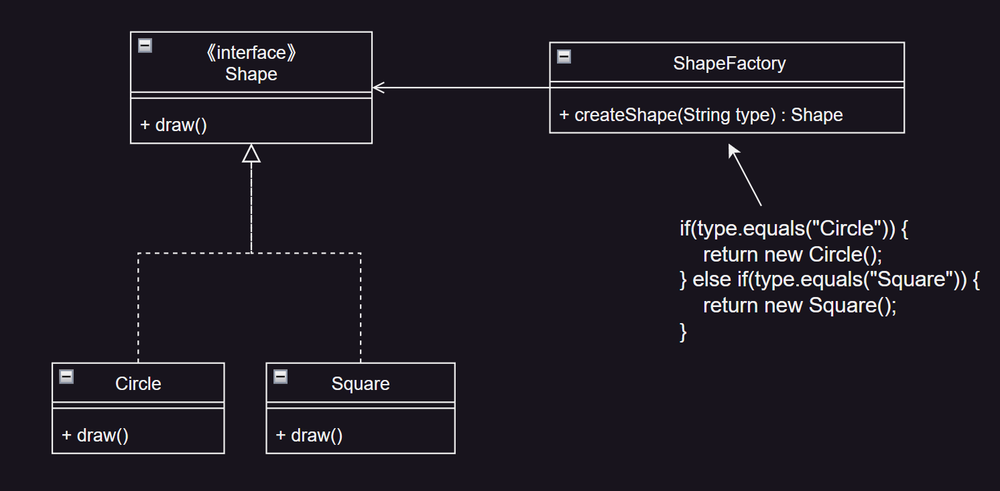
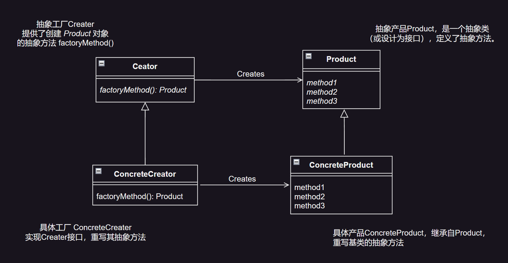
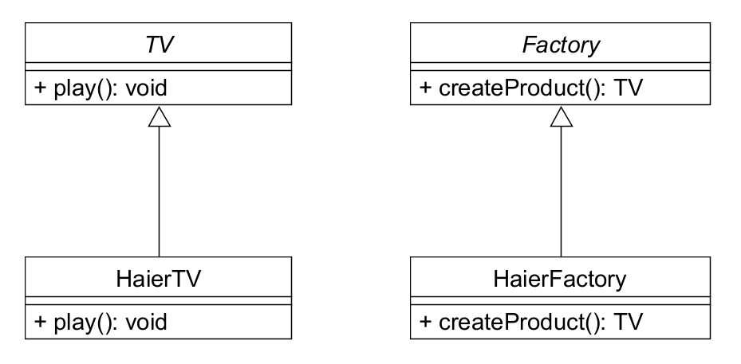
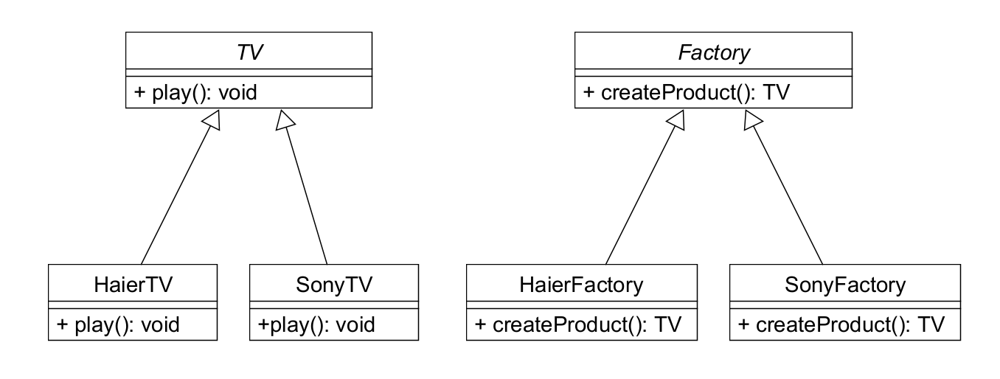

# 简单工厂模式

## 概述

在了解工厂方法模式之前，我们可以先来看什么是简单工厂模式（有时也称为**静态工厂方法**）。

> 简单工厂模式**将产品的创建过程封装在一个工厂类中，把创建对象的流程集中在这个工厂类里面**。

简单工厂模式的核心是**工厂类**，在没有工厂类之前，客户端一般会使用`new`关键字来直接创建产品对象。引入工厂类之后，客户端可以通过调用工厂类的静态方法得到产品对象。

简单工厂模式的要点在于：当你需要什么，只需要传入一个正确的参数，就可以获取你所需要的对象，而无须知道其创建细节。

## 角色分析



简单工厂模式一般有三个主要角色：

- 抽象产品：描述产品的通用行为。
- 具体产品：实现抽象产品。
- 工厂类：负责创建产品，通过会提供一个静态方法供客户端使用，通过传入参数的不同可以创建不同的产品对象。

## 模式分析

简单工厂模式虽然可以简化客户端操作，客户端无须知道所创建的具体产品类的类名，只需要知道具体产品类所对应的参数即可。

但是，一旦添加新产品就不得不修改工厂类的逻辑（修改那个静态方法），在产品类型较多时，有可能造成工厂逻辑过于复杂，不利于系统的扩展和维护。

---

# 工厂方法模式

> 工厂方法模式（Factory Method）：
> 
> - **定义一个用于创建对象的接口，让子类决定实例化哪一个类**。
> - **该模式使一个类的实例化延迟到其子类**。

## 概述

上述提到的简单工厂模式只有一个工厂类，负责创建所有产品。如果要添加新的产品，通常需要修改工厂类的代码。

工厂方法（Factory Method）模式，引入了抽象工厂和具体工厂的概念，每个具体工厂只负责创建一个具体产品（重写抽象工厂定义的抽象方法），这样，我们在添加新产品类时只需要添加新的工厂类，而无需修改原来工厂类的代码。这就使得产品的生产更加灵活，支持扩展，符合开闭原则。

工厂方法模式通过**定义一个单独的创建对象的方法来解决这些问题**。由子类实现这个方法来创建具体类别的对象。

## 角色分析



工厂方法模式一般有四个个主要角色：

- 抽象工厂 `Creator`：**定义抽象工厂方法，用于创建产品对象**。
- 抽象产品 `Product`：**描述产品的通用行为**。
- 具体工厂 `ConcreteCreator`：**实现了抽象工厂中的抽象方法，创建具体的产品**。
- 具体产品 `ConcreteProduct`：**具体的产品，是工厂创建的真正对象**。

代码如下：

- 抽象工厂 `Creator`：
  ```java
  // 抽象工厂
  public abstract class Creator {
      // 抽象工厂方法
      public abstract Product factoryMethod();
  
      // 其他方法...
      public void someOperation() {
          // 通常在这些方法实现中，需要调用工厂方法来获取Product对象
          Product product = factoryMethod();
          // 调用product的方法...
      }
  }
  ```
  - 比如上述代码中，抽象工厂方法`factoryMethod()`的返回值的抽象产品类`Product`，因此具体产品类需要实现这个方法，生成具体的实例。因此我们说工厂方法模式使一个类的实例化延迟到其子类完成。
- 抽象产品 `Product`：
  ```java
  public abstract class Product {
  	// 定义Product的属性和方法...
  
  }
  ```
  - 抽象产品类，定义了工厂方法模式中生成的那些实例所持有的属性和方法，具体的处理则由子类`ConcreteProduct`角色来决定。
- 具体工厂 `ConcreteCreator`：
  ```java
  public class ConcreteCreator extends Creator {
      // 重写工厂方法，返回一个具体的Product对象
  	public Product factoryMethod() {
  		return new ConcreteProduct();
    }
  }
  ```
  - 具体工厂类负责生成具体的产品，返回一个具体的`Product`实现类。
- 具体产品 `ConcreteProduct`：
  - 实现抽象产品，是工厂创建的对象。
  ```java
  public class ConcreteProduct extends Product {
  	// 实现Product要求的方法
  }
  ```

## 举个栗子



我们首先来看客户端的使用效果：

```java
// 客户端代码，使用工厂创建产品并调用其方法
public class Client {
    public static void main(String[] args) {
        // 创建海尔工厂实例
        Factory haierFactory = new HaierFactory();

        // 使用工厂创建产品，这里是海尔电视
        TV haierTv = haierFactory.createProduct();

        // 调用产品的方法
        haierTv.play();
    }
}
```

运行效果：

```
（1）海尔工厂正在生产海尔电视机...
（2）已创建“海尔电视机”...
（3）海尔电视机播放中...
```

下面具体介绍每个角色。

产品角色（Product）：

- `TV`表示工厂方法模式中的抽象产品“电视机”，由抽象类来实现（也可以定义为接口）。

```java
abstract class TV {  //角色1：Product 
    /**
     * 抽象TV类：表示抽象产品（电视机），在该类中仅声明 play 抽象方法，表示电视机在播放
     */
    public abstract void play();
}
```

工厂角色（Creator）：

- `Factory`是一个抽象类，声明创建产品对象的抽象方法`createProduct`，具体处理让子类去实现。

```java
abstract class Factory {  //角色2：Creator
    /**
     * 电视机工厂生产电视机产品
     * @return
     */
    public abstract TV createProduct();
}
```

具体产品角色（ConcreteProduct）：

- `HaierTV`是产品角色`TV`的实现类，是工厂方法创建的实际对象。

```java
class HaierTV extends TV {  //角色3：ConcreteProduct

    public HaierTV(){
        System.out.println("（2）已创建“海尔电视机”...");
    }

    @Override
    public void play(){
        System.out.println("（3）海尔电视机播放中...");
    }
}
```

具体工厂角色（ConcreteCreator）：

- `HaierFactory`是工厂角色`Factory`的具体实现类，实现了创建产品的方法`createProduct`，生成具体的产品对象`HaierTV`。

```java
class HaierFactory extends Factory { //角色4：ConcreteCreator
    @Override
    public TV createProduct(){
        System.out.println("（1）海尔工厂正在生产海尔电视机...");
        return new HaierTV();
    }
}
```

就这样，新增产品时，只需新增一个具体工厂类继承自抽象工厂，重写抽象工厂中的抽象方法，这样可以在不修改已有具体工厂类的情况下引进新的产品，符合开闭原则，降低了耦合度。

> 开闭原则：对修改封闭，对扩展开放。

比如现在，我们引入新的产品：索尼电视机。

```java
class SonyTV extends TV {  //角色：ConcreteProduct

    public SonyTV() {
        System.out.println("（2）已创建“索尼电视机”...");
    }

    @Override
    public void play(){
        System.out.println("（3）索尼电视机播放中...");
    }
}
```

以及具体的工厂类：

```java
class SonyFactory extends Factory { //角色：ConcreteCreator

    @Override
    public TV createProduct(){
        System.out.println("（1）索尼工厂正在生产索尼电视机...");
        return new SonyTV();
    }
}
```

现在，我们来客户端中测试一把：

```java
public class Client{ //客户端
    public static void main(String[] args){
		Factory haierFactory = new HaierFactory();
		TV haierTv = haierFactory.createProduct();
		haierTv.play();
		System.out.println("----------");
		Factory sonyFactory = new SonyFactory();
		TV sonyTv = sonyFactory.createProduct();
		sonyTv.play();
    }
}
```

运行效果：

```
（1）海尔工厂正在生产海尔电视机...
（2）已创建“海尔电视机”...
（3）海尔电视机播放中...
----------
（1）索尼工厂正在生产索尼电视机...
（2）已创建“索尼电视机”...
（3）索尼电视机播放中...
```

类图如下：




# 总结

> “在工厂方法模式中，父类决定实例的生成方式，但并不决定所要生成的具体的类，具体的处理全部交给子类负责。将生成实例的框架（framework）和实际负责生成实例的类进行解耦”。

我们总结一下，对于工厂方法模式来说，它就是封装一个创建对象的抽象类（或者说接口），由该抽象类的子类来决定实例化哪一个产品类，因此我们说工厂方法模式将类的实例化延迟到子类中完成。产品类可以有很多个，作为客户端（调用者）来说，只需调用工厂方法返回产品即可（我要什么你就给我什么）。