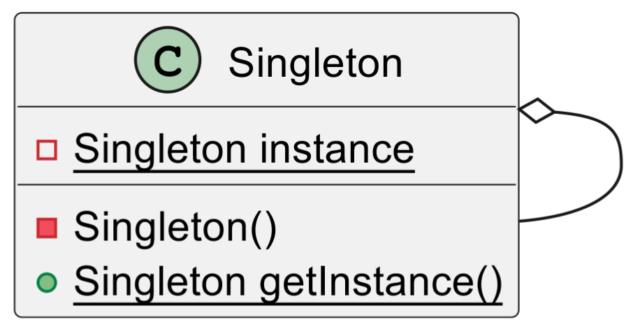

# 单例模式

> 在Java中，单例模式的经典应用例子包括：
>
> 1. **Java运行时环境**：`Java`的`Runtime`类使用了单例模式，每个`Java`应用程序都有一个`Runtime`类实例，使得应用程序可以与其运行的环境进行交互。
>
> 2. **Spring框架的Bean**：在`Spring`框架中，Bean默认的作用域是单例。也就是说，`Spring`容器中的每个`Bean`默认都是单例的，这样可以节省资源，提高效率。
>
> 3. **日志记录器**：如`Log4J`和`SLF4J`等日志框架，通常会将日志记录器设计为单例，这样可以避免因为创建多个日志记录器实例而导致的资源浪费。
>
> 4. **数据库连接池**：如`Apache`的`DBCP`和`C3P0`等数据库连接池，通常设计为单例，这样可以避免创建多个数据库连接池实例，确保所有的数据库连接都从同一个连接池中获取。
>
> 5. **配置类**：对于一些存储配置信息的类，通常也会设计为单例，这样可以确保在整个应用程序中，配置信息有且只有一份。
>
> 这些都是单例模式在Java中的经典应用例子，它们都利用了单例模式的特性，确保了类的实例在应用程序中的唯一性，从而避免了因为创建多个实例而导致的资源浪费。

## 定义和目的

> 单例模式：确保一个类只有一个实例，并提供一个全局访问点来访问这个唯一实例。

在开发中，经常有这样一些特殊的类，必须保证它们在系统中只存在一个实例，每次使用该类时，必须使用同一个实例。这样的类称为单例类，而这种设计模式称为单例设计模式，属于创建型模式。

例如，某个服务器的配置信息类，一般情况下，一个应用系统只有一个配置文件，因此也就只有一个配置信息类的实例；又如，某个系统只能有一个窗口管理器或文件系统，也只能有一个计时工具或ID（标识符）生成器等等。

## 类图和组件

掌握单例模式只需记住三个要点：

- **自行创建实例**：提供私有的构造方法，保证类的外部无法使用`new`来创建实例
- **只能有一个实例**：提供一个自身的静态私有成员变量，保存类的唯一实例
- **向整个系统提供这个实例**：提供一个公有的静态方法，用于获取单例类的实例对象。

类图如下：



这三个要点确保了系统内只有一个该类的实例，并且这个实例易于被外部访问

## 代码示例

单例模式的实现⽅式有多种，包括饿汉式和懒汉式。

### 饿汉式

**饿汉式指的是在类加载时就完成了实例化，无论后面会不会用到这个单例，都会先创建出来**，然后每次调用时，直接返回已经创建好的对象。优点是没有线程安全问题，但可能会浪费内存。

```java
// 饿汉式
public class Singleton {
	private static final Singleton instance = new Singleton();
	private Singleton() {
		// 私有构造⽅法，防⽌外部实例化
	}
	public static Singleton getInstance() {
		return instance;
	}
}
```

### 懒汉式

**懒汉式**：在第一次调用时实例化对象，实现了懒加载。在多线程环境下，可能会创建多个实例，因此需要加锁同步。这种方式提供了线程安全，但每次访问时都需要同步，影响一定性能。

```java
// 懒汉式
public class Singleton {
    private static volatile Singleton instance;
    private Singleton() {
        // 私有构造⽅法，防⽌外部实例化
    }
    public static Singleton getInstance() {
        if (instance == null) {
            synchronized (Singleton.class) {
                if (instance == null) {
                    instance = new Singleton();
                }
            }
        }
        return instance;
    }
}
```


## 总结

单例模式主要解决的是资源共享和控制访问的问题。在某些场景下，我们需要确保某个类只有一个实例，以便所有的其他对象都能访问这个实例，而不是各自拥有一个实例。这样可以保证数据在多个实例间的同步，并且可以节省系统资源。

因此**单例模式的使用场景**如下：

1. **资源共享**：当多个对象需要共享同一份资源或信息时，例如配置信息、缓存数据等，可以使用单例模式。

2. **控制资源访问**：当需要限制资源的访问，例如日志对象、数据库连接池等，可以使用单例模式。

3. **频繁创建和销毁的对象**：对于创建和销毁成本较高的对象，或者创建和销毁会导致资源的浪费，可以使用单例模式。

4. **全局唯一服务**：例如系统中的ID生成器、注册表等，可以使用单例模式。
