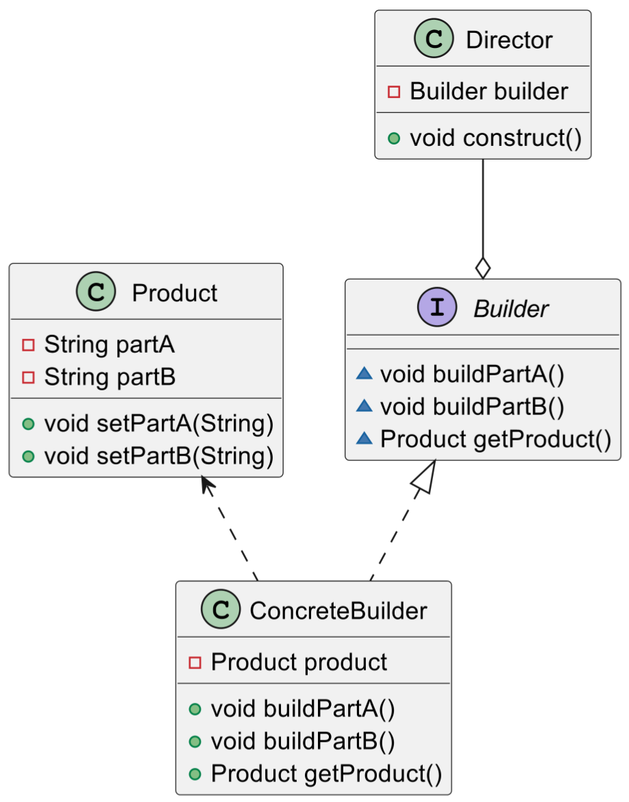

# 建造者模式

> 在`Java`中，建造者模式的经典应用例子包括：
>
> 1. **`StringBuilder`类**：`Java`的`StringBuilder`类使用了建造者模式。它允许我们通过链式调用的方式添加字符或字符串，然后最后通过`toString`方法获取最终构建的字符串。
> 2. **`Apache Commons Chain`**：这个库提供了一种基于建造者模式的方法来创建责任链。
> 3. **`Spring Boot`的`RestTemplateBuilder`**：`Spring Boot`提供了`RestTemplateBuilder`类，它使用了建造者模式来创建`RestTemplate`对象。
> 5. **`Java 8`的`Stream API`**：`Java 8`的`Stream API`使用了建造者模式。我们可以通过链式调用的方式添加各种操作，然后最后通过`collect`方法获取最终的结果。
>
> 这些都是建造者模式在`Java`中的经典应用例子，它们都利用了建造者模式的特性，通过分步骤构建复杂对象，使得代码更加清晰，易于理解。

## 定义和目的

> 建造者模式（Builder Pattern）：将一个复杂对象的构建与它的表示分离，使得同样的构建过程可以创建不同的表示。

建造者模式的主要优点是将复杂对象的构建与表示分离，使得同样的构建过程可以创建不同的表示，一步一步创建一个复杂的对象，增加了系统的灵活性。同时，它隐藏了产品内部的构建细节，对外提供统一的创建接口，简化了使用者的使用。

## 类图和组件

建造者模式主要包含以下四个角色：

1. **产品（Product）**：产品是一个复杂对象，它包含多个部分，这些部分可以按照一定的步骤和过程组合在一起。

2. **抽象建造者（Builder）**：抽象建造者是一个接口，它定义了创建产品各个部分的方法。

3. **具体建造者（Concrete Builder）**：具体建造者实现了抽象建造者的方法，提供具体的实现。

4. **指挥者（Director）**：指挥者负责调用建造者的方法来创建产品。它不涉及具体产品类的信息，只负责管理建造过程。



建造者模式的主要优点是将复杂对象的构建与表示分离，使得同样的构建过程可以创建不同的表示，增加了系统的灵活性。同时，它隐藏了产品内部的构建细节，对外提供统一的创建接口，简化了使用者的使用。

## 代码示例

```java
class Product { //复杂产品(包含多个组成部分)
    private String partA;
    private String partB;

    public void setPartA(String partA) {
        this.partA = partA;
    }

    public void setPartB(String partB) {
        this.partB = partB;
    }
}

interface Builder {//抽象建造者，定义构建产品部件的抽象方法(这些⽅法通常⽤于设置产品的各个属性)
    void buildPartA();
    void buildPartB();
    Product getProduct();
}

class ConcreteBuilder implements Builder { //具体建造者(实现抽象建造者接⼝，构建具体的产品)
    private Product product = new Product();

    @Override
    public void buildPartA() {
        product.setPartA("Part A");
    }

    @Override
    public void buildPartB() {
        product.setPartB("Part B");
    }

    @Override
    public Product getProduct() {
        return product;
    }
}

class Director {//指挥者(控制构建产品的顺序和步骤)
    private Builder builder;

    public Director(Builder builder) {
        this.builder = builder;
    }

    public void construct() { //控制产品的建造过程
        builder.buildPartA();
        builder.buildPartB();
    }
}
```

客户端代码如下，创建具体建造者对象和指挥者对象，并通过指挥者对象来构建产品：

```java
public class Client {
    public static void main(String[] args) {
        Builder builder = new ConcreteBuilder();	// 创建具体建造者
        Director director = new Director(builder);	// 创建指挥者
        director.construct();	// 指导者构建产品
        Product product = builder.getProduct();	//  获取构建好的产品
        System.out.println(product);	// 输出产品信息
    }
}
```


## 总结

在建造者模式中，产品是需要建造的复杂对象，包含多个组成部分。抽象建造者定义了创建产品各个部分的方法。具体建造者实现了抽象建造者的方法，提供具体的实现。指挥者负责调用建造者的方法来创建产品，管理建造过程。

建造者模式分离了对象子组件的单独建造（由`Builder`负责）和装配（由`Director`负责），从而可以建造出复杂的对象，实现了建造和装配的解耦。

因此，建造者模式主要适用于以下几种场景：

1. **复杂对象的创建**：当需要创建的对象具有复杂的内部结构，且对象的属性相互依赖时，建造者模式可以将这种复杂的构建过程封装在建造者中，使得对象的创建更加清晰，逻辑更加集中。

2. **构建过程需要多个步骤**：如果一个对象的构建需要多个步骤，且步骤的顺序固定，那么可以使用建造者模式。在建造者模式中，构建和表示是分离的，客户端不需要知道对象的构建过程和细节，只需要知道建造者即可。

3. **构建过程和表示分离**：当需要生成的对象有多种表示，且这些表示的构建过程相同或类似，只是细节不同时，可以使用建造者模式。通过使用不同的具体建造者，可以创建出不同的产品。

4. **对象的创建过程需要进行细粒度控制**：如果需要在创建对象的过程中进行更细粒度的控制，例如，可能需要在某些步骤完成后，根据结果决定是否继续其他步骤，那么可以使用建造者模式。
