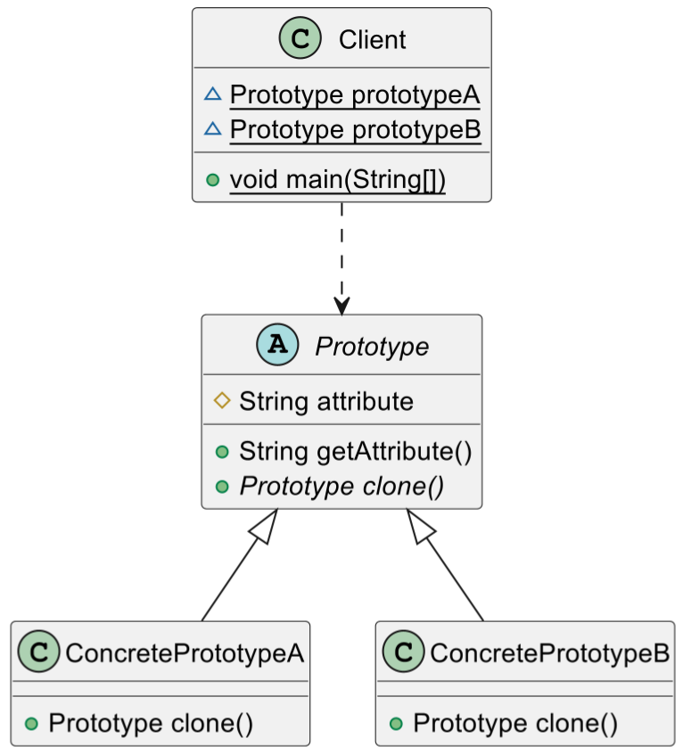

# 原型模式

## 定义和目的

为什么需要原型模式？

在开发中，有些对象的创建过程较为复杂，而且有时候需要频繁创建，原型模式通过给出一个原型对象来指明所要创建的对象的类型，然后用复制这个原型对象的办法创建出更多同类型的对象，这就是模式动机。

> **原型模式（Prototype Pattern）**：采用原型实例指定创建对象的种类，并且通过拷贝这些原型创建新的对象。原型模式允许一个对象再创建另外一个可定制的对象，无需知道任何创建的细节。

原型模式是一种创建型设计模式，它使用复制（克隆）的方式来创建对象，而不是通过新建类的实例。这种模式主要包括两个角色：原型类（Prototype）和客户类（Client）。

在Java中，可以通过实现`Cloneable`接口和重写`Object`类的`clone`方法来实现原型类。

客户类需要一个与某个对象相同的对象，它通过调用原型类的克隆方法来复制新的对象，而无需知道具体的类型。客户类不需要直接创建对象，而是请求原型类复制一个原型实例。

> 注意：
>
> 克隆复制的对象与原对象不共享内存，是完全独立的，修改克隆对象不会影响原对象，但如果对象内部有引用类型属性，需要注意深浅拷贝的问题。

## 类图和组件

理解设计模式的结构和它的主要组件。

## 代码示例

通过具体的代码示例来理解和学习设计模式，帮助理解工作原理

## 浅克隆和深克隆

被复制对象的属性值与原型对象相同的属性值相同。如果原型对象包含引用类型的对象作为成员，则克隆对象的引用类型仍然指向原来的对象，这种方式称之为浅克隆。浅克隆仅仅复制值类型（如char、int和double等类型）的成员变量，而不复制引用类型（如class、interface和数组等）的对象。也就是说，其中的引用类型的成员并不复制（特殊的String类型除外）。浅克隆存在的问题是，当修改克隆对象的引用类型的成员变量的属性时，原型对象也会相应地改变，即浅克隆对象与原型对象不是真正独立。原型对象除了它本身被复制外，它所包含的所有成员变量也将被复制，这种克隆称之为深克隆。当原型对象的成员变量是引用类型时，需要对它再做一次克隆。

## 总结

很多软件提供的复制、粘贴功能都是原型模式的应用。原型模式用以实现**类型相同、内存地址不同**的对象复制。原型模式通过**复制一个已有实例**简化对象的创建过程。

因此，原型模式适用于以下场景：

1. 类初始化消耗资源较多，如数据、硬件资源等。
2. 系统需要大量体积小、类相似的对象时。
3. 需要避免创建一个与产品类层次平行的工厂类层次时。

